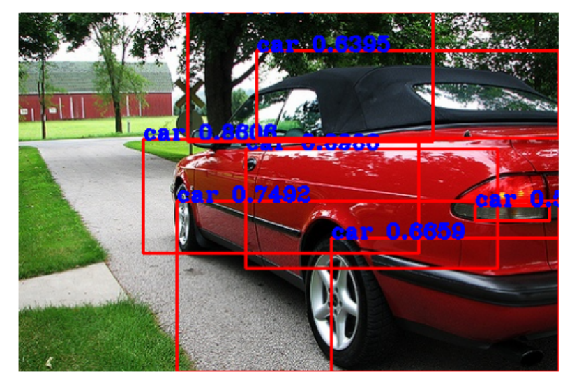
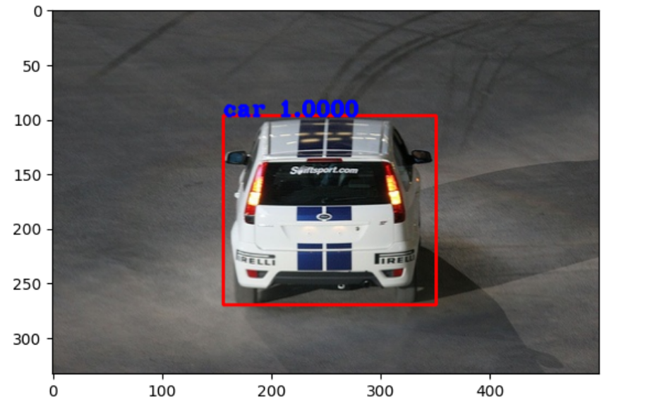

# R-CNN Object Detection (From Scratch) - Pascal VOC 2007

This project implements R-CNN from scratch for object detection using the Pascal VOC 2007 dataset.

## 📦 Dataset
- Pascal VOC 2007 (Object detection with bounding boxes)

## 🧠 Model Details
- Region Proposal using Selective Search
- Feature Extraction using CNN
- Resnet50 as a Architecture
- Classifier using  R-CNN


## 📷 Sample Result

this way the the selective search will predict pounding boxex



## 🛠️ Run Instructions
```bash
git clone https://github.com/sriharan0804/rcnn_from_scratch_using_voc2007.git
cd rcnn_from_scratch_using_voc2007
!pip install torch
!pip install torchvision
google colab
jupyter notebook